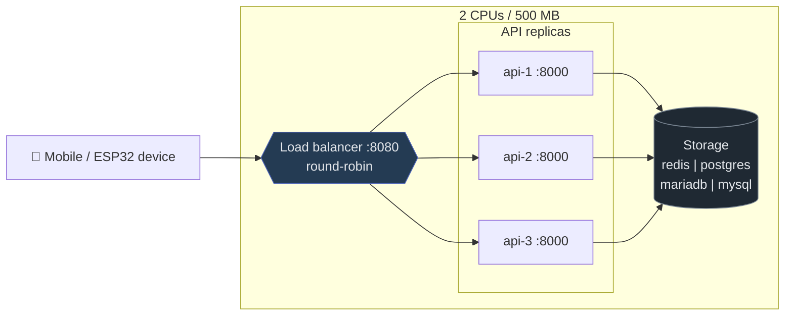
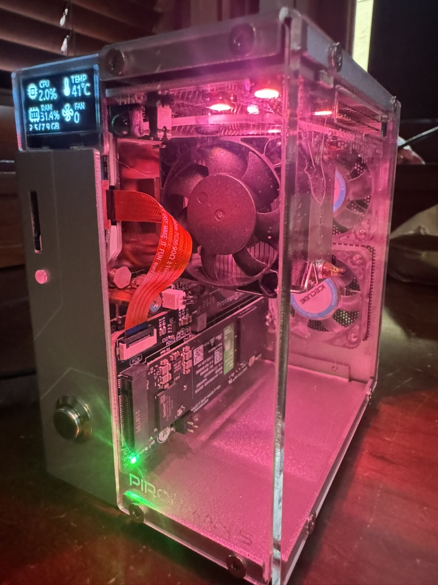

# The 500MB Club Challenge - Backend language benchmark on constrained edge hardware


Você vai construir um serviço de ingestão e consulta de telemetria de dispositivos (**lat/lon, bateria, aceleração nos 3 eixos**). A escolha do domínio é proposital: tem write-heavy realista, leitura por janela temporal e uma rota CPU-bound para evitar que o vencedor seja só "quem faz menos coisa".

A ideia é comparar runtimes de backend em hardware de borda real (Raspberry Pi), com a stack inteira limitada a **2 CPUs e 500 MB de RAM**.



## Cenário

Uma plataforma de delivery e mobilidade (_pense nos apps de delivery e mobilidade líderes do mercado_) que opera milhares de entregadores e motoristas simultâneos numa cidade. Cada profissional roda um app que reporta posição GPS, bateria do celular e acelerômetro continuamente enquanto está em rota. O backend precisa: ingerir esse fluxo em escala, deixar o cliente final acompanhar "seu pedido está chegando" (_query da rota recente_), e detectar anomalias operacionais (entregador parado tempo demais, possível acidente via acelerômetro, desvio suspeito).

Esse é o serviço que, na vida real, fica atrás do mapinha que se mexe na tela quando você espera o jantar ou o carro. É write-heavy, latência-sensível na cauda (_mapa que trava irrita o cliente_), e roda em escala.

Este repositório contém **apenas a infraestrutura compartilhada**: 2 scripts de carga k6 (smoke e steady) e o contrato OpenAPI. Cada submissão implementa a própria API na linguagem de sua escolha e publica uma imagem Docker que se encaixa nessa moldura.

## Quick start

1. Crie um repositório público com licença aprovada pela OSI (MIT, Apache-2.0, BSD, etc).
2. Crie duas branches: `main` para a implementação da API e `implementation` com os arquivos necessários para rodar o teste (_docker compose_, _configs_ ).
3. Implemente a API seguindo o contrato [OpenAPI](openapi.yaml) e as regras de fairness. Mais detalhes em [API.md](API.md).
4. Publique a imagem no Docker Hub ou GHCR.
5. [Abra o PR](SUBMITTING.md)!

## Regras de fairness

- O desafio é aberto a qualquer runtime, framework ou linguagem de programação.
- O ambiente de execução é docker-compose com limites estritos de CPU e memória.
  - O teto agregado de 2 CPUs e 500 MB é inviolável.
- Não é permitido o uso de modo privilegiado.
- **Storage permitido**: `redis`, `postgres`, `mariadb` ou `mysql`. São os quatro engines que cabem de forma realista no orçamento de 500 MiB — outros bancos (Mongo, Cassandra, Elastic, ClickHouse, Cockroach, etc.) pedem 512 MiB–1 GiB só de heap e estouram o teto sozinhos. O motivo detalhado e o perfil de hardening de cada engine estão em [`SECURITY.md`](./SECURITY.md#storage-suportado-allowlist).

## Pontuação

A nota é **relativa a um perfil-alvo absoluto** (SLOs de latência + orçamento de 2 CPU / 500 MB), **não** à nenhuma implementação específica: **`100` = você atende o alvo**, acima disso = você o supera. O **score global** (média ponderada de 6 dimensões — eficiência, capacidade, latência p99, resiliência, footprint, estabilidade) decide o ranking, e cada dimensão dá uma **medalha** ao líder. O cálculo completo (cenários, pesos, alvos, o "joelho" de capacidade, o gate e a política de métrica ausente) está em [`SCORING.md`](./SCORING.md).

## O que cada submissão precisa entregar

1. **Repositório público** com licença aprovada pela OSI (MIT, Apache-2.0, BSD, etc).
2. **Imagem publicada** no Docker Hub ou GHCR.
3. **Implementação da API** seguindo o contrato [OpenAPI](openapi.yaml) e as regras de fairness.
4. Seu load balancer deve ser configurado para usar round-robin estrito, sem heurísticas adaptativas. Deve ser exposto na porta `8000`.
5. Sua branch `main` deve conter a implementação da API
6. Sua branch `implementation` deve conter somente os arquivos necessários para rodar o teste (_docker compose_, _configs_) e o arquivo `me.json`.
    - Seu arquivo `docker-compose.yml` deve estar na raiz do repositório.
7. Para submeter a implementação, clone este repositório, crie um arquivo JSON com o nome do seu usuário do GitHub dentro da pasta `submissions` contendo o seguinte:

### Arquivo `<username>.json` da pasta `submissions`

Você pode listar uma ou mais submissões (linguagens/variantes diferentes), cada uma com um `id` próprio. Os `id`s precisam ser únicos dentro do seu arquivo (podem repetir entre arquivos de outros participantes).

```json
{
  "submissions": [
    {
      "id": "go",
      "repo_url": "https://github.com/<username>/<repository-go>"
    },
    {
      "id": "python",
      "repo_url": "https://github.com/<username>/<repository-python>"
    }
  ]
}
```

Detalhes do schema e regras de validação em [SUBMITTING.md](./SUBMITTING.md).

### Arquivo `me.json` na branch `implementation`

Cada submissão deve incluir um arquivo `me.json` com as seguintes informações:

```json
{
  "collaborators": [
    {
      "name": "Carlos Gandarez",
      "social_links": ["https://github.com/gandarez", "https://www.linkedin.com/in/gandarez"]
    },
    {
      "name": "Rapha Rossi",
      "social_links": ["https://www.linkedin.com/in/rapha-rossi"]
    }
  ],
  "stack": ["go", "redis", "nginx"]
}
```

## Endpoints obrigatórios

Resumo — detalhamento completo em `openapi.yaml` e [API.md](API.md):

- `POST   /devices/{id}/telemetry`
- `POST   /devices/{id}/telemetry/batch`
- `GET    /devices/{id}/telemetry?from=&to=&limit=&cursor=`
- `GET    /devices/{id}/anomaly`
- `GET    /healthz`
- `GET    /readyz`
- `GET    /metrics`

## Decisões intencionais

**Por que 3 instâncias com 2 CPUs reais?** Sim, é proposital expor o overhead da horizontalização. Runtimes single-process bons em throughput (BEAM, Go, Java moderno) tendem a usar melhor os núcleos sem replicação. O experimento mede exatamente quanto isso custa.

**Por que round-robin estrito?** `least_conn` ou heurísticas adaptativas escondem a variância de tail latency entre as instâncias. O round-robin fixo expõe quem tem GC stop-the-world ou pause patológico.

## Hardware

O desafio roda em Raspberry Pi 5, 8 GB de RAM, 500 GB de armazenamento SSD, Raspberry Pi OS (64-bit) Debian Bookworm, ARM64.


